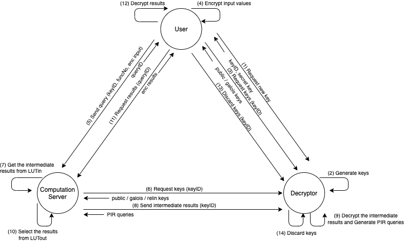
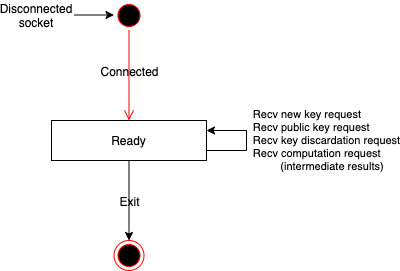

# FHE-Table-Search

FHE-Table-Search is a library of function evaluation of fully homomorphic encryption using table lookup.


# Prerequisites
* Ubuntu LTS 18.04.2
* gcc 6.3.0
* cmake 3.14.1
* [Microsoft/SEAL 3.2.0](https://github.com/microsoft/SEAL/)
* doxygen (to generate documentation)
* xterm (to run demo app using `demo.sh`)

# How to build
1. Build and install [Microsoft SEAL].
2. Run the following commands at the root of the repository to build the library.
    ```sh
    $ git submodule update -i
    $ mkdir build && cd build
    $ cmake ..
    $ make
    ```
3. Once the library is built, return to the root of the repository.

    the following files generated.

| File | Content |
|:---|:---|
| `build/fts/fts_dec/libfts_dec.so` | Decryptor library |
| `build/fts/fts_cs/libfts_cs.so` | ComputationServer library |
| `build/fts/fts_user/libfts_user.so` | User library |
| `build/fts/fts_share/libfts_share.so` | Shared library |
| `build/stdsc/stdsc/libstdsc.so` | stdsc library (see: stdsc/README.md) |
| `demo/dec/dec` | Decryptor demo app |
| `demo/cs/cs` | ComputationServer demo app |
| `demo/user/user` | User demo app |

# Documents

## API Reference
1. Run the following command at the root of the repository to create the API reference.
    ```sh
    $ cd doc && doxygen
    ```
2. see `doc/html/index.html`

## Basic specification
1. Download from [Actions/build_documents](https://github.com/iihiro/FHE-Table-Search/actions?query=workflow%3Abuild_documents)

# How to run
1. Run the following command at the root of the repository to run demo app.
    ```sh
    $ ./demo.sh
    ```

# Demo App
The demo app consists of three processes: Decryptor, ComputationServer and User. These processes communicate as shown in the following figure.



## Decryptor demo app
* Behavior
    * Decryptor receives the new key request, then returns new keys (public key, secret key, context) and keyID. (Fig: (1)(2))
    * Decryptor receives a public key request, then returns a public key and context. (Fig: (5))
    * Decryptor receives a key discardation request, then discard keys specified keyID. (Fig: (12)(13))
    * Decryptor receives intermediate results, then decrypts it, generates and returns an encrypted PIR queries. (Fig: (7)(8))
* Usage
    ```sh
    Usage: ./dec [-p port] [-c config_filename]
    ```
    * -p port : port number (type: int)
    * -c config_filename : file path of configuration file (type: string) (*OPTINAL*)
* Configuration
    * Specify the following encryption parameters in the configuration file.
        ```
	poly  = 8192   (Default: 8192)
	coeff = 192    (Default: 192)
	plain = 786433 (Default: 786433)
        ```

* State Transition Diagram
    * 

## ComputationServer demo app
* Behavior
    * ComputationServer receives a query from User, then begin the computation and returns the queryID. (Fig: (4))
    * ComputationServer sends a public key request to Decryptor, then receives the public key. (Fig: (5))
    * ComputationServer gets intermediate results from LUTin. (Fig: (6))
    * ComputationServer sends intermediate results to Decryptor, then receives PIR queries. (Fig: (7))
    * ComputationServer re-constructs queries from PIR queries and gets the results from LUTout. (Fig: (9))
    * ComputationServer receives a result request from User, then returns encryped results. (Fig: (10))
* Usage
    ```sh
    Usage: ./cs [-p port] [-f LUT_filepath] [-m max_queries]
    ```
    * -p port : port number (type: int)
    * -f LUT_filepath : LUT filepath (type: string)
    * -m max_queries : max concurrent queries (type: int)
* State Transition Diagram
    * 

## User demo app
* Behavior
    * User sends a new key request to Decryptor, then receives a secret key, public key and keyID. (Fig: (1))
    * User encrypts input values using the public key and sends a query containing the encryped input and keyID to ComputationServer. (Fig: (3)(4))
    * User sends a result request to ComputaionServer, then receives encryped results and decrypt it using secret key.  (Fig: (10)(11))
    * User sends a discardation key request to Decryptor to discard keys specified keyID. (Fig: (12))
* Usage
    ```sh
    Usage: ./user value1 [value2]
    ```
    * value1 value1 (type: int)
    * value2 value2 (type: int) (*OPTINAL*)

# License
Copyright 2018 Yamana Laboratory, Waseda University
Supported by JST CREST Grant Number JPMJCR1503, Japan.

Licensed under the Apache License, Version 2.0 (the "License");
you may not use this file except in compliance with the License.
You may obtain a copy of the License at

http://www.apache.org/licenses/LICENSE-2.0

Unless required by applicable law or agreed to in writing, software
distributed under the License is distributed on an "AS IS" BASIS,
WITHOUT WARRANTIES OR CONDITIONS OF ANY KIND, either express or implied.
See the License for the specific language governing permissions and
limitations under the License.
